### React.

  - React: es una biblioteca de javaScript de código abierto diseñada para crear interface de usuario.

  - Bibliotecas: Son un conjunto de implementaciones u herramientas para escribir nuestro código.

### Conceptos basicos.

  - Componente: Es una parte de la intefas de usuario que es independiente y reutilizable (Actuan como bloques o como lego).

    - se dividen en.

      - Funcionales. (Mas conciso y mas facil)
        Es una función de JavaScript/ES6 que retorna un elemento de React(jsx).

          

          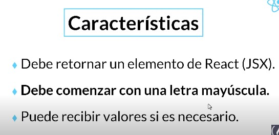

        - props: Son argumentos que pueden recibir los componentes de react. **Solo pueden ser enviados de padre a hijo**
          
          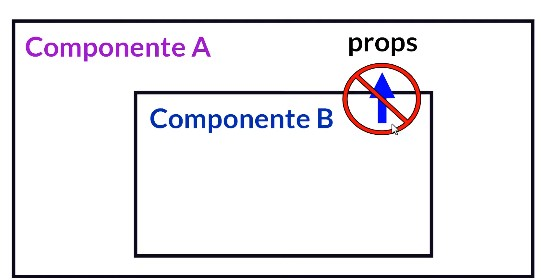

      - De Clase.

        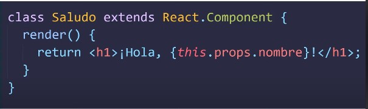

        Cuando usamos una clase debemos usar this.

        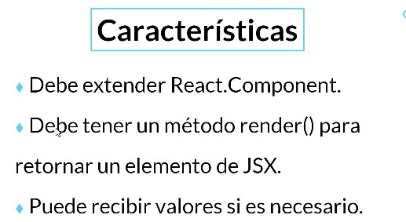

  - Estado de un componente:

    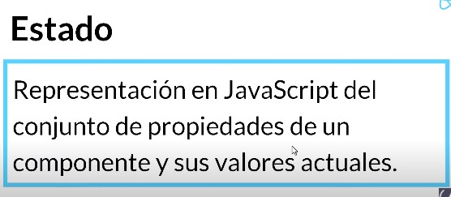

  - Hook:

    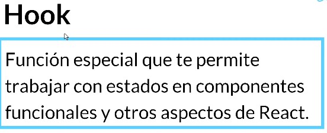

  - Event Listener.

    
    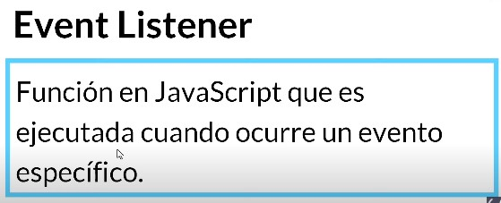

### JSX.

- Es una extención de React para la sintaxis de JavaScript.

  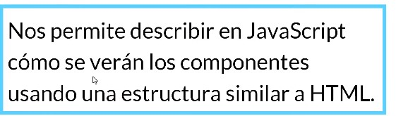

  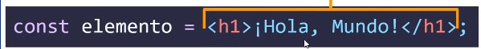

### React DOM.

  Paquete que facilita la interacción y actualización del DOM en aplicaciones React. **DOM** significa **Document object Model**. es una representación en el navegador de todos los elementos que conforman una página o aplicación web.

### Esctructura de un componente.

   
  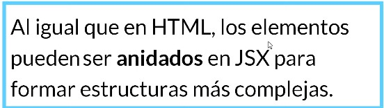

  - Una ves que se define la estructura del componente es importante saber como renderizarlo.

  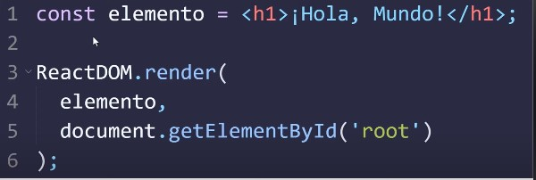

### Crear un proyecti react.
   

   - Primero en la terninar usamos el comando.
      ~~~
        npx create-react-app mi-app
        npm start 
      ~~~

      ~~~
        npx create-react-app mi-app
        npm start 
      ~~~
  
  - Unas de las cosas claves a hacer es identificar los componentes que necesitaremos para nuestra app.

### Crear un componente.

  - Podemos usar iconos populares instalando React Icons.
  - El paquete uuid se utiza para crear un identificador unico.

  ~~~
  npm install react-icons --save
  npm install uuid
  ~~~

 